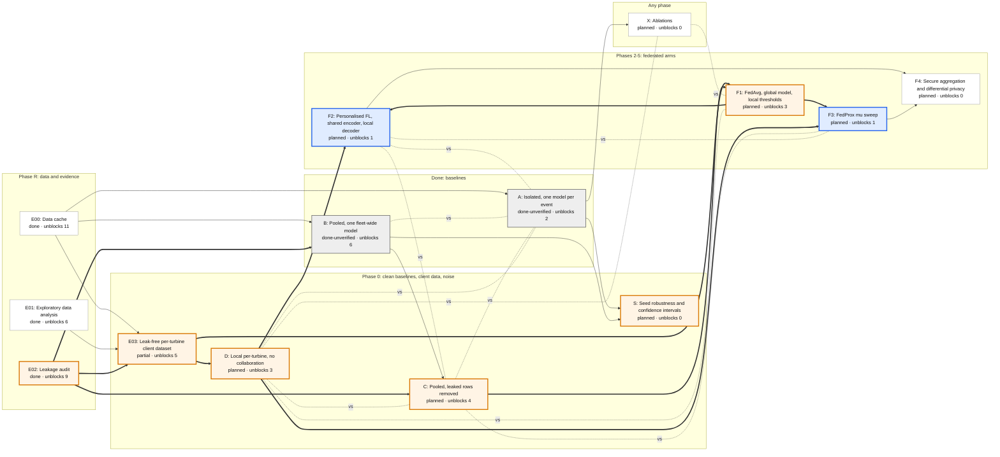

# Experiment graph

The headline experiments (F2, F3) sit behind three unrun gates: **C**, **D** (which needs the leak-free client dataset E03) and **F1**. The leakage audit E02 is the one finished gate, and it feeds all of them.

<!-- generated:start -->

<!-- generated:end -->

**How to read it.** Lanes run left to right in the order the work must happen. A thick arrow leaves a gate: the next experiment cannot be trusted until the gate's result is in. A thin arrow is a data dependency. A dashed "vs" line marks the baseline an experiment is judged against. "Unblocks N" counts every experiment downstream, which is the simplest measure of how much rides on that node. Colours: orange border = gate, blue = headline, grey = done baseline, white = supporting.

## What each comparison answers

| Comparison | Question it answers | Status |
| --- | --- | --- |
| B vs A | Is one fleet model better than per-event models? (confounded: contamination and specialisation differ at once) | done: 0.583 vs 0.628 |
| C vs B | What was contamination worth? | needs C |
| C vs A | How much does specialisation matter, cleanly? | needs C |
| D vs A | Is per-turbine specialisation as good as per-event? | needs D |
| D vs C | Local-only vs centralised: the two ends of the federated dial | needs C, D |
| F1 vs C | Does federation itself cost anything? (predicted: no) | needs F1 |
| F2 vs max(C, D) | Does personalised FL beat both ends? (headline) | needs F2 |
| F3 curve between D and C | Where on the sharing dial is the optimum? (headline) | needs F3 |
| F4 vs best of F2 / F3 | What does formal privacy cost? | needs F4 |

## Why D was added

The original plan bracketed the federated work between Arm A and Arm B. With turbines as clients and leaked rows removed, the honest brackets are **D** (each turbine alone) and **C** (everything centralised, clean). A is per-event and B is contaminated, so neither is an endpoint of the federated dial.
